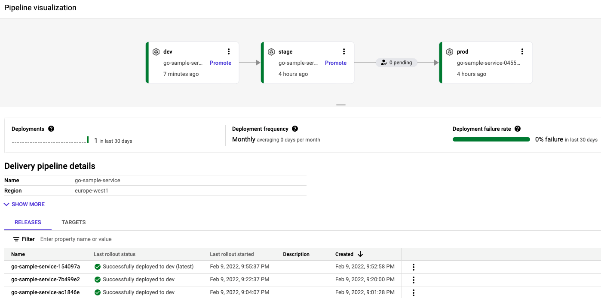
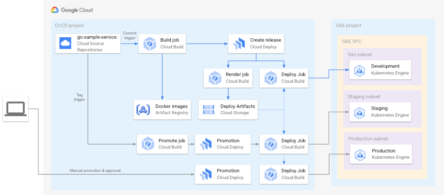

# cloud-deploy-demo

The following repository contains code to demonstrate [Google Cloud Deploy](https://cloud.google.com/deploy).

The Google Cloud Deploy is a managed service that automates delivery of your applications to a series
of target environments in a defined promotion sequence. The Cloud Deploy supports [Google Kubernetes
Engine](https://cloud.google.com/kubernetes-engine) clusters as targets for deployments.

## Contents

* [go-sample-service](./go-sample-service/) directory contains source code of a simple backend service
that will be deployed by Cloud Deploy on several GKE clusters
* [terraform](./terraform/) directory contains Terraform code for provisioning GCP infrastructure
used in this demo

## Objectives

* source code of `go-sample-service` will be hosted in GCP Source Code repository
* push to the main branch will build `go-sample-service` and deploy on *dev cluster*
* push tag will promote release (if exists) and deploy on *stage cluster*
* manual promotion and approval will deploy on *prod cluster*
* there will be separate GCP projects for CI/CD infrastructure and GKE clusters
* private networking only
* least privilege principle

## Usage

to be added

## Deployment pipeline

## High level infrastructure view

